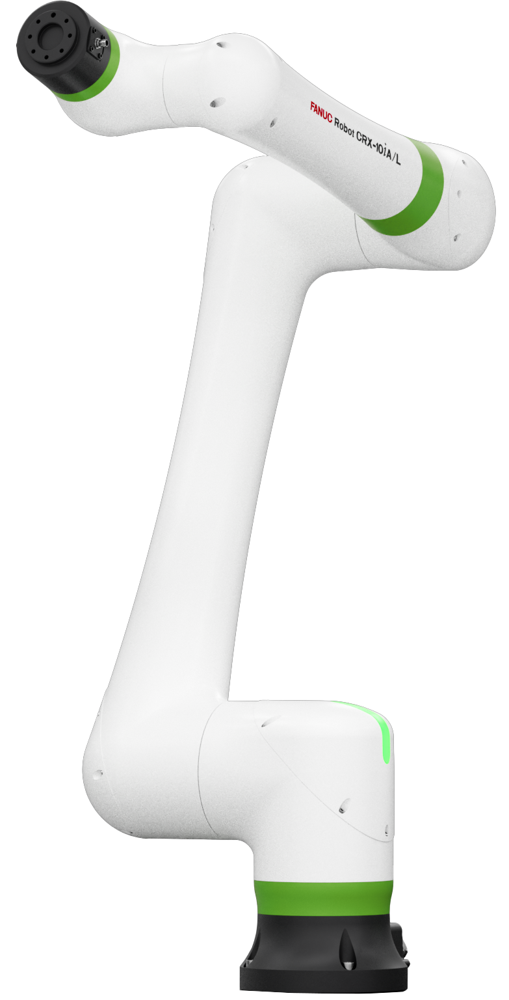
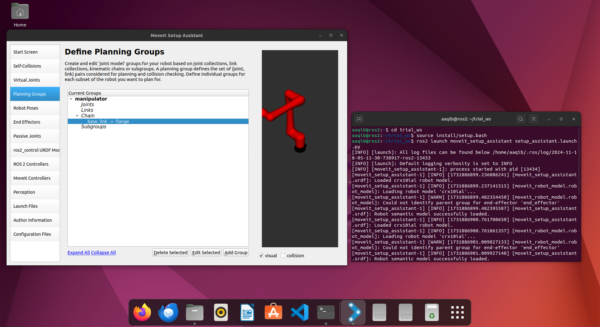

# Simulate Fanuc CRX10ia/L using ROS2 Humble and MoveIt2



<p align="center">
    
    
    
</p>

## Table of Contents
- [0. Quick Start](#0-quick-start)
- [1. ROS Setup](#1-ros-setup)
- [2. Dependencies](#2-dependencies)
- [3. Workspace Configuration](#3-workspace-configuration)
- [4. MoveIt2 Configuration](#4-moveit2-configuration)
- [5. Trajectory Planning](#5-trajectory-planning)
- [6. Simulation](#6-simulation)

## <span id="0">0. Quick Start

*Tested on Ubuntu 22.04 LTS with ROS2 Humble.*

1. **Update System**
```bash
sudo apt update && sudo apt upgrade -y
```

2. **Install ROS2 Humble Packages**
```bash
sudo apt install -y \
ros-humble-desktop \
ros-humble-rviz \
ros-humble-control-msgs \
ros-humble-sensor-msgs
```

3. **Source ROS2 Setup**
```bash
source /opt/ros/humble/setup.bash
```

## <span id="1">1. ROS Setup

### Install Core Dependencies
```bash
sudo apt install libmodbus-dev libjsoncpp-dev
```

### Install MoveIt2
```bash
sudo apt update
sudo apt install -y ros-humble-moveit ros-humble-moveit-resources
sudo apt install -y python3-colcon-common-extensions build-essential
```

## <span id="2">2. Workspace Preparation

### Create Workspace
```bash
mkdir -p ~/fanuc_ws/src
cd ~/fanuc_ws
colcon build
```

### Add CRX Description Files
```bash
# Option 1: Copy local files
cp -r /path/to/crx_description ~/fanuc_ws/src/

# Option 2: Clone Repository
cd ~/fanuc_ws/src
git clone <repository_url> crx_description
```

## <span id="3">3. MoveIt2 Configuration

### Launch MoveIt Setup Assistant
```bash
source /opt/ros/humble/setup.bash
ros2 launch moveit_setup_assistant setup_assistant.launch.py
```

### Configuration Steps
1. **Load URDF**
   - Browse and select `crx10ia_l.urdf.xacro`
   

2. **Self-Collision Matrix**
   - Generate Collision Matrix
   

3. **Virtual Joints**
   - Create Joint:
     - Name: `world_base`
     - Parent Frame: `world`
     - Child Link: `base_link`
     - Type: `fixed`

4. **Planning Groups**
   - Group Name: `manipulator`
   - Kinematics Plugin: KDLKinematicsPlugin
   - Base Link: `base_link`
   - Tip Link: `flange`
   

5. **Robot Poses**
   - Add `home` pose for `manipulator` group
   

6. **End Effector**
   - Name: `end_effector`
   - Group: `manipulator`
   - Parent Link: `flange`

## <span id="4">4. Trajectory Planning Package

### Create MoveIt2 Scripts Package
```bash
cd ~/fanuc_ws/src
ros2 pkg create moveit2_scripts --build-type ament_cmake \
--dependencies rclcpp moveit_ros_planning_interface
```

### Create Trajectory Script
`src/test_trajectory.cpp`:
```cpp
#include <rclcpp/rclcpp.hpp>
#include <moveit/move_group_interface/move_group_interface.h>

int main(int argc, char** argv) {
    rclcpp::init(argc, argv);
    auto node = rclcpp::Node::make_shared("test_trajectory");
    
    moveit::planning_interface::MoveGroupInterface move_group(node, "manipulator");

    // Plan to a target pose
    geometry_msgs::msg::Pose target_pose;
    target_pose.orientation.w = 1.0;
    target_pose.position.x = 0.28;
    target_pose.position.y = -0.2;
    target_pose.position.z = 0.5;

    move_group.setPoseTarget(target_pose);
    
    auto success = (move_group.plan() == moveit::planning_interface::MoveItErrorCode::SUCCESS);
    
    if (success) {
        RCLCPP_INFO(node->get_logger(), "Planning successful. Executing...");
        move_group.move();
    } else {
        RCLCPP_WARN(node->get_logger(), "Planning failed.");
    }

    rclcpp::shutdown();
    return 0;
}
```

### Launch File
`launch/test_trajectory.launch.py`:
```python
from launch import LaunchDescription
from launch_ros.actions import Node

def generate_launch_description():
    return LaunchDescription([
        Node(
            package='moveit2_scripts',
            executable='test_trajectory',
            output='screen',
        )
    ])
```

## <span id="5">5. Build and Run

### Build Workspace
```bash
cd ~/fanuc_ws
colcon build --symlink-install
source install/setup.bash
```

### Run Simulation
1. Start Move Group
```bash
ros2 launch my_moveit_config move_group.launch.py
```

2. Launch RViz
```bash
ros2 launch my_moveit_config moveit_rviz.launch.py
```

3. Execute Trajectory
```bash
ros2 launch moveit2_scripts test_trajectory.launch.py
```

## <span id="6">6. Video Demonstrations

### MoveIt2 Configuration


### Trajectory Execution


## Troubleshooting
- Ensure ROS2 Humble is correctly installed
- Verify all dependencies are met
- Check URDF and MoveIt configuration files

## Contributing
Contributions are welcome! 🤖

**Your stars, forks, and PRs are appreciated!**